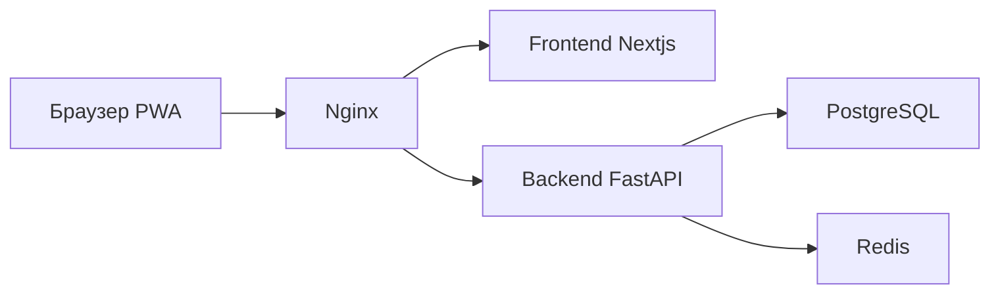

# План реализации MVP по [`TECHNICAL_SPECIFICATION.md`](../TECHNICAL_SPECIFICATION.md)

## 1. Целевая структура монорепозитория

- `backend/` API, доменная логика SRS, миграции, тесты
- `frontend/` Next.js App Router, UI, PWA
- `infra/` Docker Compose, Nginx, CI CD, env шаблоны
- `plans/` артефакты планирования

## 2. Архитектурный поток

## 3. Пошаговый план реализации

### Фаза 0. Каркас репозитория и инфраструктуры

1. Создать директории `backend/`, `frontend/`, `infra/`.
2. Добавить базовые файлы:
   - `infra/docker-compose.yml`
   - `infra/nginx/nginx.conf`
   - `.env.example`
   - `.gitignore`
3. Настроить сервисы: PostgreSQL, Redis, backend, frontend, nginx.
4. Добавить healthcheck маршруты в backend и frontend.

Критерий готовности:
- `docker compose` поднимает все сервисы, healthchecks проходят.

### Фаза 1. Backend foundation

1. Инициализировать FastAPI проект в `backend/`.
2. Подключить SQLAlchemy async, Alembic, Pydantic strict mode.
3. Реализовать модели и миграции по ТЗ:
   - users, words, categories, tags
   - word_category, word_tag
   - user_word_progress, import_logs
4. Настроить индексы, ограничения, внешние ключи.
5. Реализовать базовую конфигурацию UTC дат и Unicode NFC нормализации.

Критерий готовности:
- Миграции накатываются, схема соответствует ТЗ.

### Фаза 2. Auth и базовые API

1. Реализовать регистрацию, логин, refresh rotation.
2. Настроить JWT access и refresh.
3. Добавить middleware и зависимости авторизации.
4. Добавить rate limit для auth эндпоинтов через Redis.

Критерий готовности:
- Полный сценарий auth работает и покрыт тестами.

### Фаза 3. SRS ядро и учебный контур

1. Реализовать модифицированный SM 2 алгоритм в backend.
2. Реализовать очередь `/api/study/queue`.
3. Реализовать оценку карточки `/api/study/review`.
4. Добавить агрегированную статистику `/api/stats`.

Критерий готовности:
- Интервалы, статусы, сортировка и границы соответствуют ТЗ.

### Фаза 4. Импорт экспорт и безопасный merge

1. Реализовать dry run импорт.
2. Реализовать execute импорт в единой транзакции.
3. Реализовать Redis lock на импорт пользователя.
4. Реализовать UPSERT стратегию без удаления данных.
5. Реализовать экспорт JSON с meta и words.
6. Реализовать audit в import_logs.

Критерий готовности:
- Dry run показывает diff, execute не удаляет данные, аудит пишется.

### Фаза 5. Frontend

1. Инициализировать Next.js App Router проект в `frontend/`.
2. Настроить Tailwind и React Query.
3. Реализовать страницы:
   - `/`
   - `/study`
   - `/dictionary`
   - `/admin/import`
   - `/profile`
4. Реализовать компоненты flashcard, preview импорта, фильтры, progress ring.
5. Интегрировать API backend, обработку ошибок и состояния загрузки.

Критерий готовности:
- Пользовательский сценарий учебной сессии и админ импорт работают.

### Фаза 6. PWA и offline

1. Добавить `manifest.json`.
2. Настроить service worker для кэша статики и fallback.
3. Реализовать IndexedDB кэш очереди с синхронизацией после reconnect.

Критерий готовности:
- Базовый offline режим для учебного экрана работает.

### Фаза 7. Качество, тесты, CI CD

1. Реализовать unit и integration тесты backend.
2. Реализовать E2E тест учебного сценария frontend.
3. Добавить k6 нагрузочный сценарий.
4. Настроить CI CD pipeline в `infra/.github/workflows/`.
5. Добавить линтеры и проверку типов.

Критерий готовности:
- Тесты проходят, метрики нагрузки соответствуют ТЗ.

### Фаза 8. Финализация и выпуск

1. Проверить соответствие каждому пункту ТЗ.
2. Подготовить эксплуатационные инструкции:
   - запуск
   - миграции
   - импорт экспорт
   - резервные копии
3. Провести финальный smoke check в docker окружении.

Критерий готовности:
- Полный MVP готов к деплою на один VPS согласно ограничениям ТЗ.

## 4. Definition of Done для MVP

- Реализованы все обязательные API и страницы из ТЗ
- Импорт экспорт работает в safe merge режиме
- SRS логика корректна по граничным случаям
- PWA offline fallback работает
- Compose инфраструктура и healthchecks стабильны
- Тесты и CI CD настроены
